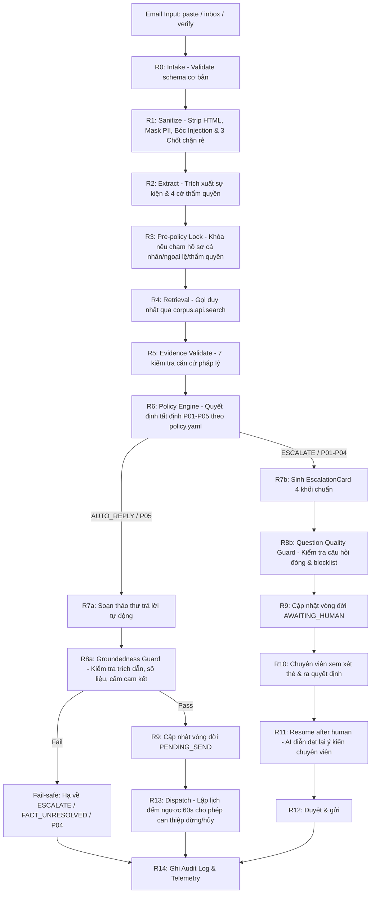

# Quy tắc Hợp tác & Tiêu chuẩn Triển khai Đồng bộ (Agent A - B - C)

Quy chuẩn này là căn cứ tối cao điều phối hoạt động phát triển mã nguồn giữa 3 thành viên / 3 AI Agent (Làn A, B, C) nhằm đảm bảo hệ thống **Escalation Referee** hoạt động ổn định, thống nhất, không xung đột và tuân thủ tuyệt đối quy chế Hackathon (Sprint 1, tối đa 8 phút trình diễn).

---

## 1. Phân định Làn & Ranh giới Sở hữu (Ownership Boundaries)

Mỗi Agent chỉ được phép tạo mới và chỉnh sửa các file thuộc thư mục sở hữu của mình. **Tuyệt đối không sửa file thuộc làn khác khi chưa có sự đồng thuận qua quy trình CONTRACT-CHANGE.**

| Làn & Agent | Trách nhiệm chính | Thư mục sở hữu | Phạm vi CẤM sửa trực tiếp |
|---|---|---|---|
| **Làn A — Runtime** | Pipeline R0–R14, Policy Engine, Extraction, Guards, Controls, Dispatch, Resume, Plain Explain | `core/`, `policies/`, `tests/test_pipeline_*.py`, `tests/test_policy_*.py`, `tests/test_guards.py`, `tests/test_extract_*.py`, `tests/test_generate_*.py`, `tests/test_question_*.py`, `tests/test_dispatch_*.py`, `tests/test_controls.py`, `tests/test_explain.py` | `corpus/*` (ngoại trừ gọi qua `corpus.api`), `infra/*`, `pages/*` |
| **Làn B — Corpus Admin** | Nạp văn bản (PDF/DOCX/TXT/URL), Chuẩn hóa, Legal Chunking, Gắn nhãn, Phát hiện xung đột, Vòng đời quy định (Supersede, Rollback), Hybrid Indexing | `corpus/`, `data/seed_docs/`, `pages/3_Quan_tri_quy_dinh.py`, `tests/test_chunker.py`, `tests/test_conflict.py`, `tests/test_corpus_*.py`, `tests/test_lifecycle.py`, `tests/test_indexer.py`, `tests/test_metadata*.py`, `tests/test_coverage.py` | `core/*`, `infra/*`, các trang UI khác (`pages/1,2,4,5,6`) |
| **Làn C — Infra / UI / Verify** | Cơ sở dữ liệu SQLite WAL & Migrations, Logging Audit, Telemetry, LLM Client & Cassettes, Streamlit UI, Verify Harness & Case Sets | `infra/`, `streamlit_app.py`, `pages/` (trừ page 3), `verify/`, `data/seed_inbox.json`, `docs/`, `tests/test_db.py`, `tests/test_audit*.py`, `tests/test_llm.py`, `tests/test_telemetry.py`, `tests/test_settings.py`, `tests/test_harness.py`, `tests/test_verify_*.py` | `core/*`, `corpus/*` |

### File Dùng chung (Shared Contracts)
- `core/types.py`: Chứa toàn bộ Dataclass và Enum chuẩn (Single Source of Truth về kiểu dữ liệu).
- `infra/migrations/001_init.sql`: Lược đồ CSDL quan hệ SQLite dùng chung.
- `TASKBOARD.md`, `STATUS.md`, `BLOCKERS.md`: Đồng bộ tiến độ và trạng thái.

---

## 2. Luồng Xử lý Chuẩn R0 -> R14 (Unified Execution Flow)

Mọi yêu cầu xử lý email đầu vào từ bất kỳ kênh nào (`paste`, `inbox`, `verify`) đều **phải đi qua duy nhất một điểm vào**:
`core.pipeline.process_case(inp: CaseInput, *, actor: str = "SYSTEM") -> PipelineResult`



---

## 3. Hợp đồng Giao tiếp Liên Module (Inter-Module Contracts)

1. **Giao tiếp Làn A và Làn B:**
   - Làn A **chỉ được phép** import từ `corpus.api`:
     ```python
     from corpus.api import search, get_corpus_version, is_active, get_chunk, supported_domains
     ```
   - Làn A **tuyệt đối không** import trực tiếp các module nội bộ của Làn B (`corpus.store`, `corpus.indexer`, `corpus.chunker`, v.v.).
   - Mọi chunk trả về từ `corpus.api` phải là kiểu `EvidenceChunk` chuẩn định nghĩa tại `core.types`.

2. **Giao tiếp Làn A/B và Làn C:**
   - Gọi ghi audit duy nhất qua: `infra.audit.log_event(...)`.
   - Kết nối DB duy nhất qua: `infra.db.get_connection()`.
   - Gọi LLM duy nhất qua: `infra.llm.call_json(...)` (sử dụng mode `replay` đọc cassette khi chạy test để hoàn toàn offline).
   - Lấy tham số cấu hình/ngưỡng qua: `infra.settings`.

3. **Giao tiếp UI và Runtime/Corpus:**
   - Các trang Streamlit (`pages/*.py`) chỉ được gọi tầng dịch vụ (`core.pipeline.process_case`, `core.controls.*`, `corpus.lifecycle.*`, `corpus.intake.*`), **không viết logic nghiệp vụ trực tiếp trong file UI**.

---

## 4. Tiêu chuẩn Triển khai Tinh gọn (Ponytail Standards)

1. **Ưu tiên Thư viện Chuẩn (Stdlib First):**
   - Trước khi import dependency bên ngoài, bắt buộc cân nhắc thư viện chuẩn (`hashlib`, `urllib.request`, `json`, `re`, `sqlite3`, `dataclasses`, `difflib`).
   - Đã loại bỏ hoàn toàn sự phụ thuộc bắt buộc vào `sentence_transformers`/`torch` nặng 500MB trong môi trường runtime cơ bản bằng `DefaultEmbedder` chuẩn hóa L2 dựa trên numpy + hashlib có sẵn.

2. **Không trừu tượng hóa thừa (YAGNI & No Over-Engineering):**
   - Cấm tạo Factory, Abstract Base Class, Protocol nếu chỉ có đúng 1 implementation thực tế.
   - Cấm viết các hàm bọc (wrapper) chỉ làm nhiệm vụ chuyển tiếp tham số mà không thêm giá trị.
   - Luôn chọn dạng code ngắn nhất, dễ đọc nhất, dễ bảo trì nhất.

3. **Không Fail-Open (Nguyên tắc An toàn Tuyệt đối):**
   - Mọi ngoại lệ không lường trước hoặc lỗi LLM/mất kết nối trong quá trình xử lý email **đều phải rơi an toàn về `ESCALATE / FACT_UNRESOLVED / P04`**, không bao giờ được phép đoán mò hay phát hành phản hồi sai lệch cho sinh viên.
   - Hàm `process_case()` không bao giờ để lọt Exception ra ngoài làm sập UI; luôn bọc thành `PipelineResult` có `status=CaseStatus.ERROR` hoặc `AWAITING_HUMAN`.

---

## 5. Quy trình Git & Kiểm chuẩn (Git & Testing Workflow)

1. **Nhánh làm việc:**
   - Nhánh tích hợp chính: `dev`.
   - Nhánh tính năng/nhiệm vụ: `agent-a/<task-id>-<slug>`, `agent-b/...`, `agent-c/...` tạo từ `dev`.
   - Khi hoàn thành task, rebase/pull mới nhất từ `dev`, giải quyết xung đột tại nhánh của mình, sau đó merge hoặc push lên `dev`.

2. **Cấm tuyệt đối trên Git:**
   - **CẤM `git push --force`** hoặc viết lại lịch sử commit. Lịch sử commit là bằng chứng đánh giá năng lực của hội đồng giám khảo.
   - **CẤM commit file dữ liệu tạm thời**: `data/app.db`, `data/*.db`, `embedding_cache/`, `__pycache__/`, `.env`, hoặc khóa API bí mật.

3. **Điều kiện Nghiệm thu Commit (Merge Gate):**
   Trước khi đẩy bất kỳ commit nào lên `dev` hoặc `main`, bắt buộc chạy và đạt 100%:
   ```powershell
   # 1. Kiểm tra Linting (phải 0 lỗi, tuân thủ ruff.toml)
   python -m ruff check .

   # 2. Toàn bộ 169 unit tests phải PASS
   python -m pytest tests/

   # 3. Chạy bộ Verify Harness chuẩn
   python -m verify.harness --set verify4
   ```

---

## 6. Xử lý Tranh chấp & Thay đổi Hợp đồng (CONTRACT-CHANGE Protocol)

Nếu một thành viên/Agent phát hiện cần thay đổi hợp đồng giao tiếp (ví dụ: thêm trường vào `CaseInput`, `EvidenceChunk`, sửa bảng SQLite, thêm `action` audit):
1. Không được tự ý sửa một mình.
2. Ghi rõ lý do và đề xuất vào `BLOCKERS.md` và `AGENT.md`.
3. Chỉ sau khi cả 3 bên thống nhất, một Agent duy nhất thực hiện cập nhật đồng bộ trên `core/types.py`, `PROJECT_SPEC.md` và các file liên quan trong cùng một commit.
